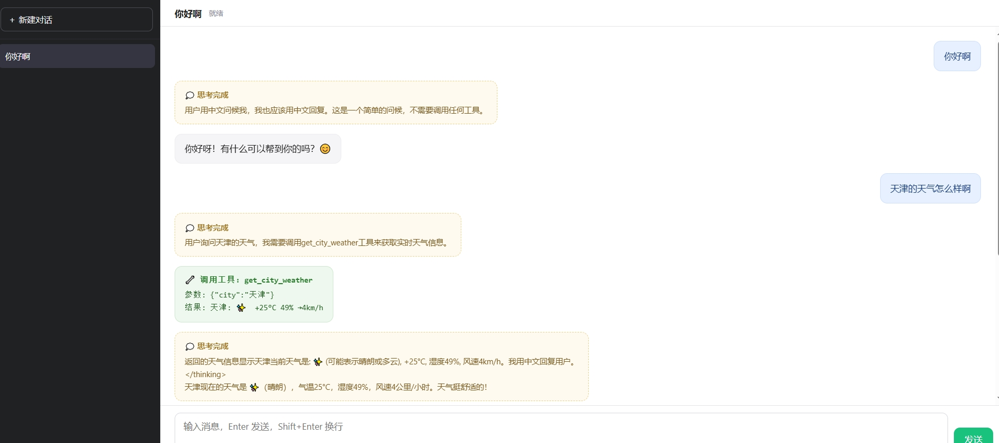

<p align="center">
  <a href="./README.md">中文</a> | <a href="./README_EN.md">EN</a>
</p>

# Introduction
A secondary development project based on pi-agent-core core code implemented in Python. You can register custom tools as needed for agent use.

Readers should evaluate the performance differences between Python and TypeScript on their own.





Features implemented in this repo:
- [x] Unified pi local source installation via pip, use `from pi.py_ai import *` directly, see `pi/` directory
- [x] Multi-turn CLI agent example with model/tool/skills registration, command-line interaction: `hello_agent_loop.py`
- [x] Multi-turn web agent example with model/tool/skills/session support, web interaction: `hello_agent_loop_web.py`
- [x] Real tool registrations: `get_city_weather`, `web_search`, plus 7 built-in tools (read, write, bash, etc.), see `pi/pi_tools/`
- [x] Skill loading system with 3 initial skills, see `.pi/skills/`
- [ ] Extension loading
- [x] Runtime context compaction
- [x] Session persistence and conversation recovery, stored in `.pi/sessions/`, see `hello_agent_loop_web.py`
- [x] `docs/` directory with Python code explanations


# Quick Start
``` shell
git clone https://github.com/wqzh/hello-pypi.git && cd hello-pypi

# Install from local source, -e flag allows live edits in 'pi/'
pip install -e pi

cp .env.example .env
# Required: set PI_LLM_BASE_URL, PI_LLM_MODEL_ID, PI_LLM_API_KEY in .env

# If needed: pip install -r requirements.txt

# Single agent, multi-turn conversation
python hello_agent_loop.py    # CLI interaction

python hello_agent_loop_web.py  # local web interaction
```


# Known Issues / TODO
1. `web_search()` cannot resolve relative time expressions like "today" or "recently" — disambiguation needed
2. `get_city_weather()` only supports real-time weather; forecasts require custom implementation
3. Compaction runs after the prompt completes — context may exceed token limits mid-conversation. Should compaction timing be adjusted?


# Local Source Installation
```shell
# Reinstall (after dependency changes) in DEBUG mode:
pip install -e pi

# Production: drop the -e flag
pip install pi

# Uninstall:
pip uninstall pi

```


# Credits
- Based on the Python implementation of pi(v0.84.1) core modules from [encyc/pi-py](https://github.com/encyc/pi-py)

- https://github.com/earendil-works/pi
- https://github.com/encyc/pi-py

# License
MIT
